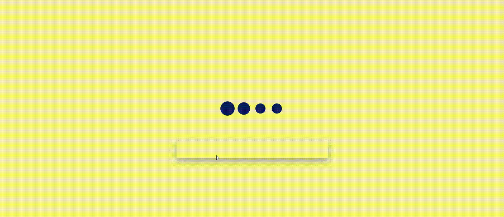

# Loading Animation

This project is a simple webpage that demonstrates a loading animation using HTML and CSS.

## Preview

## Features

- Smooth and visually appealing loading animation
- Customizable animation speed and colors
- Lightweight and easy to integrate into any webpage

## Getting Started

To get started with the loading animation, follow these steps:

1. Clone the repository or download the source code.
2. Open the `index.html` file in your web browser.
3. Enjoy the mesmerizing loading animation!

## Customization

You can customize the loading animation by modifying the CSS variables in the `styles.css` file. Here are the available variables:

- `--animation-duration`: Specifies the duration of the animation in seconds.
- `--primary-color`: Sets the primary color of the loading animation.
- `--secondary-color`: Sets the secondary color of the loading animation.

Feel free to experiment with different values to create your own unique loading animation!

## Contributing

Contributions are welcome! If you have any ideas, suggestions, or bug reports, please open an issue or submit a pull request.

## License

This project is licensed under the [MIT License](LICENSE).
